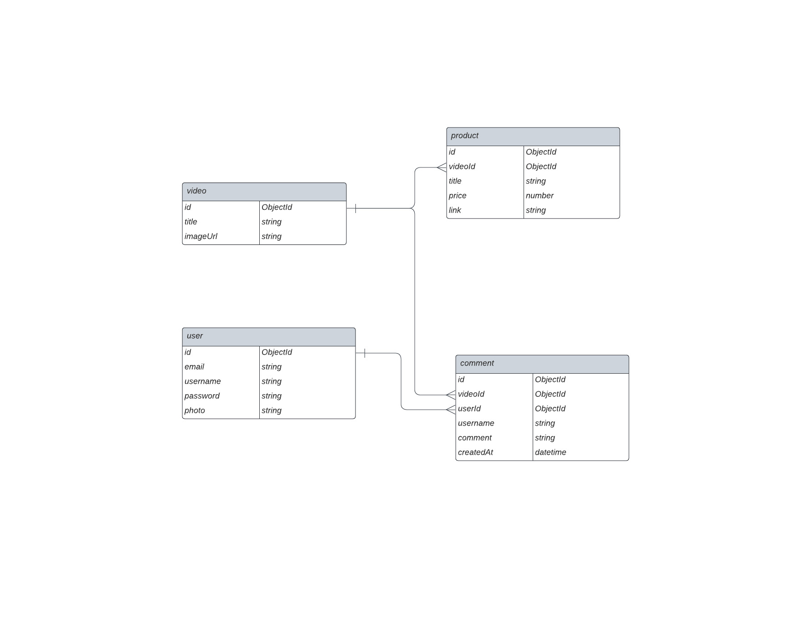

## **SETUP ( PLEASE READ )**

In order to write mongoDB command in your terminal, you need to install and configure mongoDB first in your operating system. If you have not installed mongoDB yet, please watch this video first : https://youtu.be/oC6sKlhz0OE

After setting up mongoDB, follow the instructions below

- clone this repo into your file directory
- open your terminal and cd into your root project directory
- run `npm install` ( make sure you have installed node as well )
- run `mongosh`, it should run the local server for mongoDB
- run `use youtube` to create new database called "youtube"
- run `load( "query/createCollections.js" )` to create 4 collections (video, product, user, comment)
- open new terminal and run `npm run start` to start local server

create .env file and add these variabel

```

  PORT=5000
  DB_URL=mongodb://localhost:27017/youtube

```

## **DATABASE STRUCTURE**



## **API FLOW**

```


  REQUEST -----> ROUTES -----> CONTROLLER -----> MODEL -----> DATABASE


```

## **API REQUEST AND RESPONSE**

### **GET `/api/v1/video-thumbnail`**

Returns all videos thumbnail data.

- **URL Params**  
  None
- **Data Params**  
  None
- **Headers**  
  Content-Type: application/json
- **Success Response:**
- **Code:** 200  
  **Content (Example):**

```
{
  video: [
           {
            id: asdf08108312
            title: "video-1"
            imageUrl: "http.imageurl.com"
           },
           ...
         ]
}
```

### **GET `/api/v1/comment/:videoId`**

Returns all product list based on spesific video.

- **URL Params**  
   _Required:_ `videoId=[integer]`
- **Data Params**  
  None
- **Headers**  
  Content-Type: application/json
- **Success Response:**
- **Code:** 200  
  **Content (Example):**

```
  {
    product: [
              {
                  id: asdf08108312
                  link: "www.product-link.com"
                  title: "product-title"
                  price: 125.200
              },
              ...
              ]
  }
```

### **GET `/api/v1/comment/:videoId`**

Returns all comments based on spesific video.

- **URL Params**  
   _Required:_ `videoId=[integer]`
- **Data Params**  
  None
- **Headers**  
  Content-Type: application/json
- **Success Response:**
- **Code:** 200  
  **Content (Example):**

```
  {
    comment: [
                {
                    username: "vinsen"
                    comment: "great video"
                    timestamp: 1529644667834
                },
                ...
              ]
  }
```

### **POST `/api/v1/comment/:videoId`**

Create new comment on spesific video and return the new object.

- **URL Params**  
   _Required:_ `videoId=[integer]`

* **Data Params**

```
  {
    videoId: integer,
    username: string,
    comment: string,
  }
```

- **Headers**  
  Content-Type: application/json
- **Success Response:**
- **Code:** 200  
  **Content (Example):**

```
  {
    comment: {
                username: "vinsen"
                comment: "great video"
                timestamp: 1529644667834
             },
  }
```
