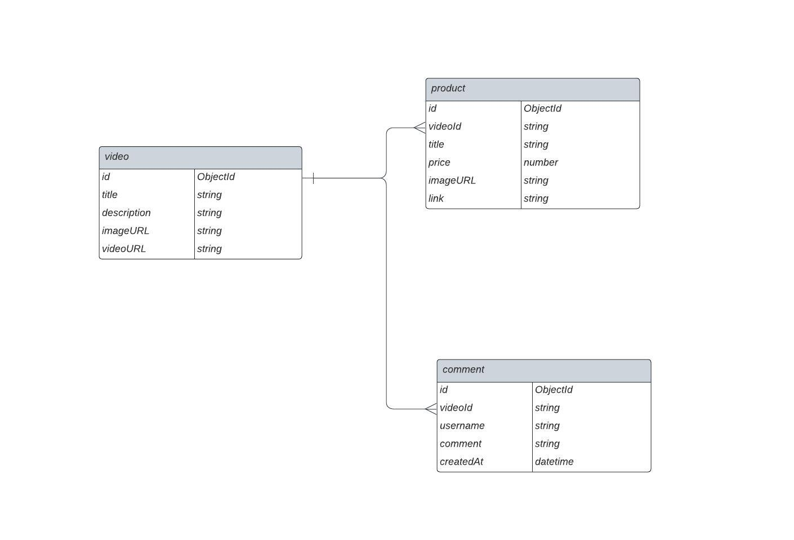

Link to the [app](https://tokopedia-play-hub.vercel.app/)

## **SETUP ( PLEASE READ )**

In order to write mongoDB command in your terminal, you need to install and configure mongoDB first in your operating system. If you have not installed mongoDB yet, please watch this video first : https://youtu.be/oC6sKlhz0OE

After setting up mongoDB, follow the instructions below

- clone this repo into your file directory
- open your terminal and cd into your root project directory
- run `npm install` ( make sure you have installed node as well )
- run `mongosh`, it should run the local server for mongoDB
- run `use youtube` to create new database called "youtube"
- run `load( "query/createCollections.js" )` to create 4 collections (video, product, user, comment)
- run `load( "query/insertVideo.js" )` to insert document into video collection
- you could also insert document into comment or product collection by using endpoint listed down below
- open new terminal and run `npm run dev` to start development local server

create `.env` file and add these variabel

```

  PORT=5000
  DB_URL=mongodb://localhost:27017/tokopedia_play


```

the database name is tokopedia play

## **DATABASE STRUCTURE**



## **API FLOW**

```


  REQUEST -----> ROUTES -----> CONTROLLER -----> MODEL -----> DATABASE


```

## **API REQUEST AND RESPONSE**

### **GET `/api/v1/video`**

Returns all videos thumbnail data.

- **URL Params**  
  None
- **Data Params**  
  None
- **Headers**  
  Content-Type: application/json
- **Success Response:**
- **Code:** 200  
  **Content (Example):**

```
{
  video: [
           {
            id: asdf08108312
            title: "video-1"
            imageUrl: "http.imageurl.com"
           },
           ...
         ]
}
```

### **POST `/api/v1/video/`**

Create new video.

- **URL Params**  
  None

* **Data Params**

```
  {
    title: string,
    description: string,
    imageURL: string,
    videoURL: string,
  }
```

- **Headers**  
  Content-Type: application/json
- **Success Response:**
- **Code:** 200  
  **Content (Example):**

```
{
  video: [
           {
            id: asdf08108312
            title: "video-1"
            description: "video-1 desc"
            imageUrl: "http.imageurl.com"
            videoURL: "http.videourl.com"
           },
           ...
         ]
}
```

### **GET `/api/v1/video/:videoId`**

Returns single video.

- **URL Params**  
   _Required:_ `videoId=[integer]`
- **Data Params**  
  None
- **Headers**  
  Content-Type: application/json
- **Success Response:**
- **Code:** 200  
  **Content (Example):**

```
{
  video:
        {
          id: asdf08108312
          title: "video-1"
          description: "video-1 desc"
          imageUrl: "http.imageurl.com"
          videoURL: "http.videourl.com"
        },

}
```

### **GET `/api/v1/product/:videoId`**

Returns all product list based on spesific video.

- **URL Params**  
   _Required:_ `videoId=[integer]`
- **Data Params**  
  None
- **Headers**  
  Content-Type: application/json
- **Success Response:**
- **Code:** 200  
  **Content (Example):**

```
  {
    product: [
              {
                  id: asdf08108312
                  videoId: 123kj0ausd0f
                  imageURL: www.image-product.com
                  link: "www.product-link.com"
                  title: "product-title"
                  price: 125.200
              },
              ...
              ]
  }
```

### **POST `/api/v1/product/:videoId`**

Create new product on spesific video.

- **URL Params**  
   _Required:_ `videoId=[integer]`

* **Data Params**

```
  {
    videoId: string
    title: string,
    price: number,
    imageURL: string,
    link: string,
  }
```

- **Headers**  
  Content-Type: application/json
- **Success Response:**
- **Code:** 200  
  **Content (Example):**

```
{
  product:
              {
                  id: asdf08108312
                  videoId: 123kj0ausd0f
                  imageURL: www.image-product.com
                  link: "www.product-link.com"
                  title: "product-title"
                  price: 125.200
              },
}
```

### **GET `/api/v1/comment/:videoId`**

Returns all comments based on spesific video.

- **URL Params**  
   _Required:_ `videoId=[integer]`
- **Data Params**  
  None
- **Headers**  
  Content-Type: application/json
- **Success Response:**
- **Code:** 200  
  **Content (Example):**

```
  {
    comment: [
                {
                    username: "vinsen"
                    comment: "great video"
                    createdAt: 1529644667834
                },
                ...
              ]
  }
```

### **POST `/api/v1/comment/:videoId`**

Create new comment on spesific video and return the new object.

- **URL Params**  
   _Required:_ `videoId=[integer]`

* **Data Params**

```
  {
    videoId: integer,
    username: string,
    comment: string,
  }
```

- **Headers**  
  Content-Type: application/json
- **Success Response:**
- **Code:** 200  
  **Content (Example):**

```
  {
    comment: {
                username: "vinsen"
                comment: "great video"
                createdAt: 1529644667834
             },
  }
```
